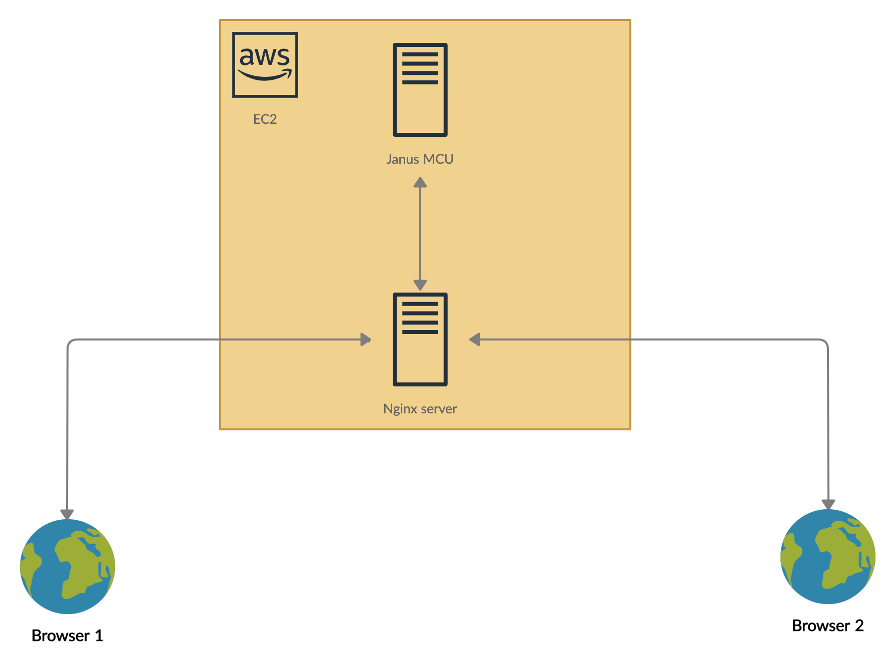
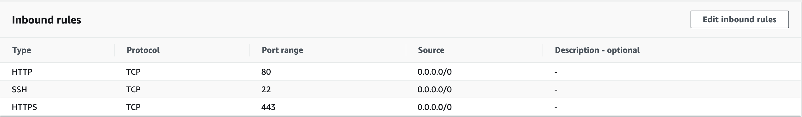

# Audio conferencing starter kit

 

---

This repository is developed with the aim to make the process of creating your first audio conferencing tool, hassle free. This document explains setting up the tool using an AWS EC2 instance running Ubuntu server, but drawing parallel to your infrastructure of choice should be easy using the links provided to the source document in each section.

---

## How it works:

There are 2 components to this tool:

- A server (Multipart Control Unit) that accepts audio stream from all clients, merges all streams together and sends one stream back to every client
- A client that accesses users' mic, sends stream to server and plays the stream got back from the server. This is achieved using WebRTC APIs available in browsers

  ##### Libraries used:

  - [Janus gateway](https://github.com/meetecho/janus-gateway) - A lean multipurpose WebRTC server
  - [Janus javascript API](https://janus.conf.meetecho.com/docs/JS.html) - API developed by Janus to interact with the Janus server.

  ##### Architecture

    

---

## Steps to build:

#### 1. Get an EC2 instance:

Get an AWS EC2 instance running Ubuntu server 18.

#### 2. Install dependencies:

SSH into your EC2 instance and execute these commands:

- `git clone https://github.com/aakashraj96/audio-conf-starter-kit.git`
- `cd audio-conf-starter-kit/dependencies`
- `bash install_primary_dependecies.sh`
- `bash install_secondary_dependencies.sh`

#### 3. Get an elastic IP for your EC2 instance

- WebRTC works only in a secure origin (https). Thus, an SSL certificate is needed. Self signed ones work too, but the browser would give a warning and user would have to ignore the warning to reach the site. In order to get a valid third party issued SSL certificate, a domain name is needed. For the domain name to point to the EC2 instance, a reserved public IP (elastic IP) is needed.
- Create a new elastic IP in your AWS dashboard and associate the IP to the instance you are using.

#### 4. Get a free domain name

- There are many free domain name providers. One such provider is https://my.freenom.com
- After getting a free domain name, go to dns management section in domain name provider website, in type A row, add the elastic public IP as target.

#### 5. Edit security groups

- Edit your instance's security group and allow port 80 on TCP and port 443 in HTTPs in inbound rules.
  
- Visiting the domain name (Http) you created in step 4, should show the `Welcome to nginx` page.

#### 6. Install SSL certificate

SSH into your EC2 instance and run the following:

- `sudo snap install --classic certbot`
- `sudo certbot --nginx` - Mention your domain name when the prompt asks

Now, your domain name will be accessible using https.

#### 7. Install janus server

Run the following in your EC2 instance:

- `git clone https://github.com/meetecho/janus-gateway.git`
- `cd janus-gateway`
- `sh autogen.sh`
- `./configure --prefix=/opt/janus`
- `sudo make`
- `sudo make install`
- `sudo make configs`

#### 8. Launch janus server

Insert your EC2 instance public IP in the below command and launch janus server as a background process in port 8088.

- `/opt/janus/bin/janus --nat-1-1=<EC2_INSTANCE_PUBLIC_IP> --keep-private-host --daemon`

#### 9. Setup a reverse proxy to janus server in nginx config

- Open nginx config present in `/etc/nginx/sites-available`. Setup reverse proxy to janus server by pasting following inside the ssh server block. To identify easily, paste the following block below `server_name <Your_domain_name>; # managed by Certbot`:

        location /api/ {
                proxy_pass http://localhost:8088/;
        }

- Restart nginx for config to reflect:
  `sudo systemctl restart nginx`

#### 10. Copy client files to nginx folder

- `cd ~/audio-conf-starter-kit/` - assuming you cloned this repo to home folder
- `cp -a ./client_assets/. /var/www/html/`

That's it! Visit your domain using https, allow permission to access mic and join an audio call.
